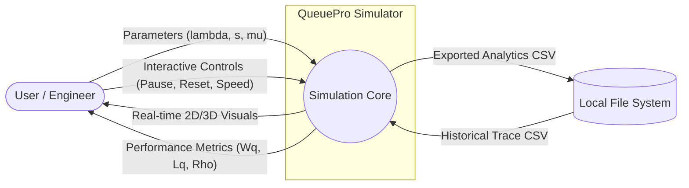
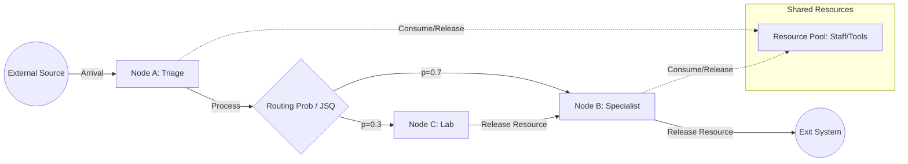

# QueuePro Data Flow Diagram (DFD) v4.0

This document provides a multi-level visualization of data movement within the QueuePro SAAS application. It follows standard DFD conventions to illustrate how user configurations are transformed into stochastic simulation states and ultimately into visual analytics.

## 1. Context Diagram (Level 0)
The highest level view of the system, showing external entities and the primary data boundary.



## 2. Functional Decomposition (Level 1)
Detailing the interaction between the React UI layer, the custom Hooks, and the Logic Engines.

```mermaid
flowchart TD
    %% Inputs
    UI[ConfigPanel UI] -->|SimulationUIConfig| Hook[useSimulation Hook]
    Lab[DataLab] -->|TraceEntry[]| Hook
    
    %% Simulation Lifecycle
    subgraph Logic_Layer [Logic & Math Layer]
        Hook -->|Instantiate / Update| Engine[SimulationEngine]
        Hook -->|tick: dt * simSpeed| Engine
        Engine <-->|Random Var Requests| Math[MathUtils]
        Math -- "Probability Distributions" --> Engine
        Math -- "Theoretical Baseline" --> Hook
    end
    
    %% State Propagation
    Engine -->|getState: SimulationState| Hook
    Hook -->|Active State| UI_Render[React Render Tree]
    
    %% Consumers
    subgraph View_Subsystems [Visualization Subsystems]
        UI_Render -->|Positions & Types| Scene3D[Three.js Scene]
        UI_Render -->|Vectors & Velocity| Physics2D[Canvas Physics]
        UI_Render -->|Statistical Snapshot| Charts[Recharts Components]
        UI_Render -->|Raw Counters| Metrics[Metrics Cards]
    end
    
    %% Storage & Export
    UI_Render -->|Buffer| Hist[(Historical Buffer)]
    Hist -->|CSV Mapping| Export[CSV Export Engine]
    Export -->|Download| Disk([User Disk])
```

## 3. Internal Engine Logic Flow (Level 2)
A detailed view of data transformation inside a single `tick(deltaTime)` call within the `SimulationEngine`.

```mermaid
flowchart TD
    Start([Tick Start]) --> Staff[Adjust Staffing: s(t)]
    Staff --> Maint[Check MTBF/MTTR: Set Server State]
    
    Maint --> ArrivalCheck{isArrivalTime?}
    ArrivalCheck -- Yes --> NewCust[Instantiate Customer Object]
    NewCust --> Routing{Check Topology}
    
    Routing -- Common --> Q_Comm[Push to Global Queue]
    Routing -- Dedicated --> Q_Ded[Push to Shortest Server Queue]
    
    ArrivalCheck -- No --> Assign[Assign Idle Servers]
    Q_Comm --> Assign
    Q_Ded --> Assign
    
    Assign --> Serv[Service Process: Update Customer finishTime]
    Serv --> DepartCheck{currentTime >= finishTime?}
    
    DepartCheck -- Yes --> Stats[Update Accumulators: sumW, sumWq]
    Stats --> Artifacts[Create Visual Departure Artifacts]
    Artifacts --> History[Record Snapshot if Interval Reached]
    
    DepartCheck -- No --> Update[Update Cumulative Metrics: L, Lq]
    History --> End([Tick End])
    Update --> End
```

## 4. Network Data Flow (Multi-Node)
Visualization of how customers flow through the Jackson Network system.



## 5. Data Structures (Dictionary)
| Data Object | Description | Key Attributes |
| :--- | :--- | :--- |
| `SimulationUIConfig` | Raw user input from UI sliders and toggles. | `lambda`, `mu`, `serverCount`, `distributionType` |
| `SimulationConfig` | Sanitized configuration passed to the Engine. | All values converted to sim-ready numbers (e.g. rates to minutes). |
| `Customer` | The atomic entity in the simulation. | `id`, `arrivalTime`, `serviceTime`, `priority`, `finishTime` |
| `SimulationState` | The comprehensive snapshot of the system. | `queue[]`, `servers[]`, `currentTime`, `totalWaitTime` |
| `ChartDataPoint` | Aggregated metrics for a specific timestamp. | `time`, `wq`, `lq`, `utilization` |
