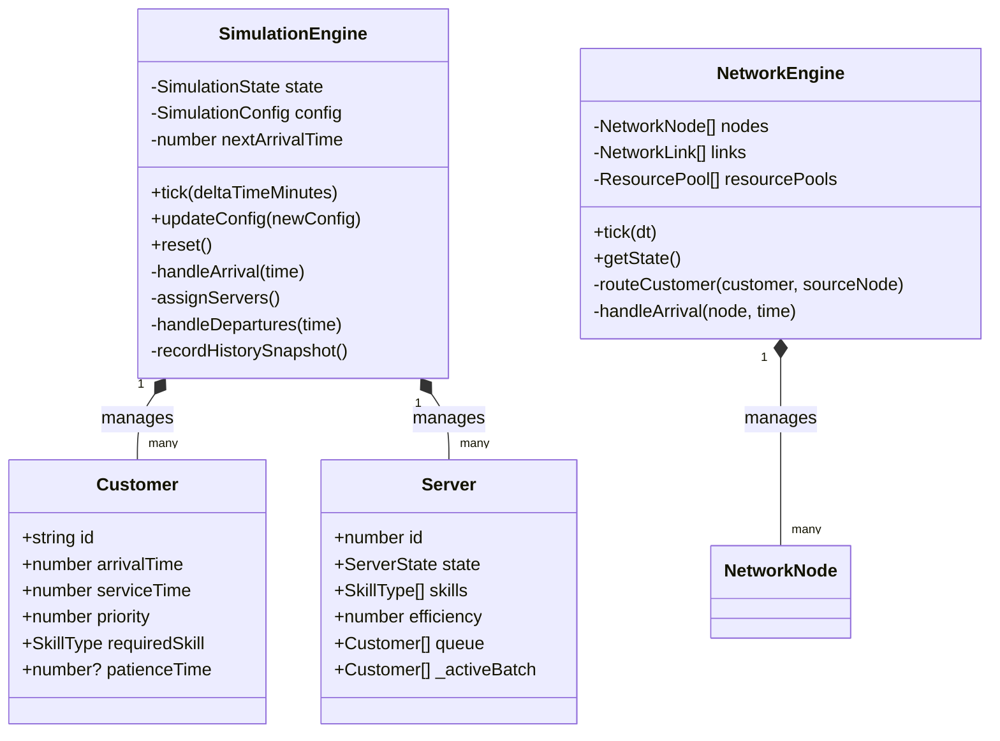
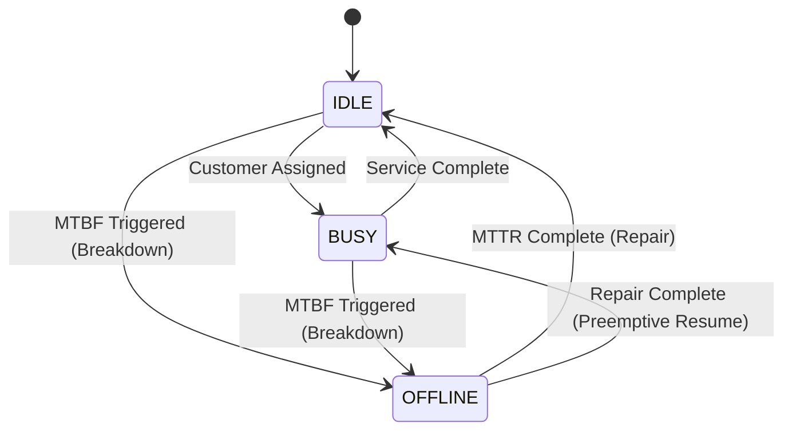
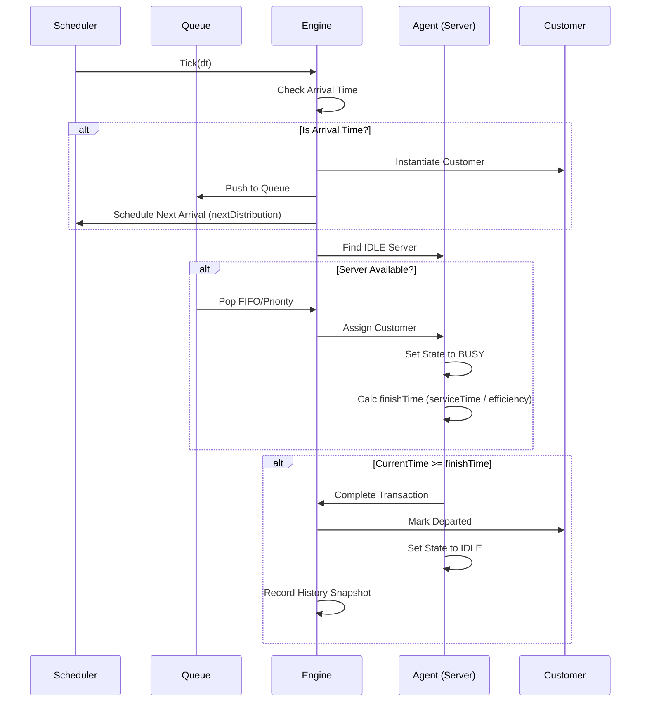
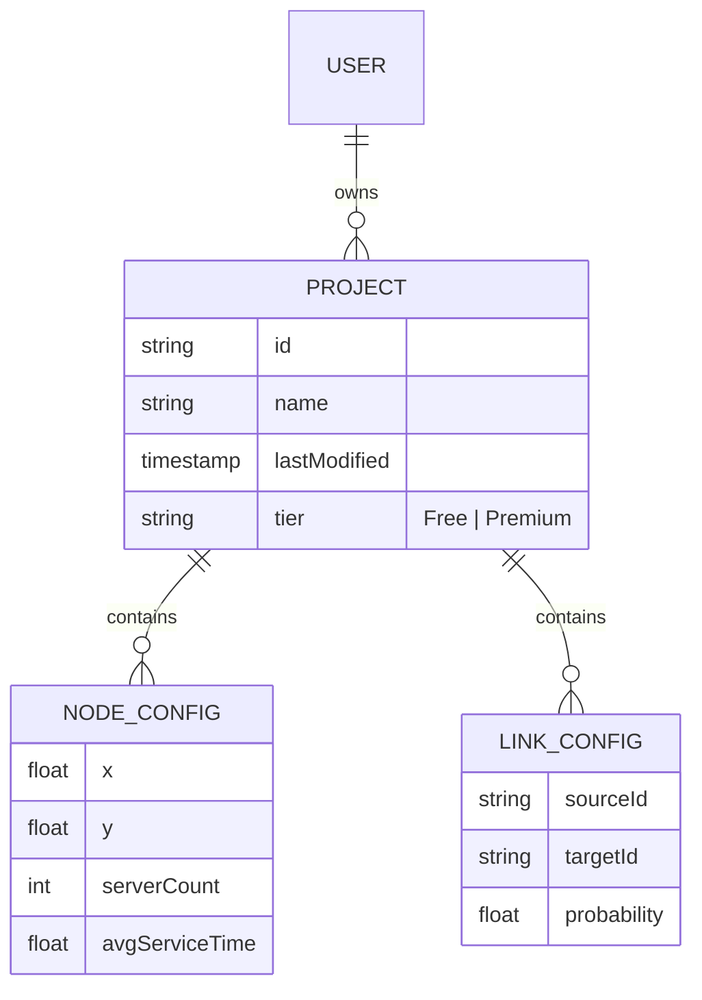

# QueuePro UML Specification v4.0

This document provides a technical blueprint of the QueuePro SAAS application using Unified Modelling Language (UML) standards, represented via Mermaid.js.

## 1. System Architecture (Component Diagram)
QueuePro follows a decoupled architecture where the mathematical simulation engines are independent of the React rendering layer.

```mermaid
componentDiagram
    [User Browser] <<Frontend>> as UI
    [SimulationEngine] <<Logic>> as SE
    [NetworkEngine] <<Logic>> as NE
    [MathUtils] <<Utility>> as MU
    [useSimulation Hook] <<State Bridge>> as Hook

    UI --> Hook
    Hook --> SE
    UI --> NE
    SE ..> MU : uses
    NE ..> MU : uses
    
    UI --> [Recharts] : Data Viz
    UI --> [Three.js] : 3D Scene
    UI --> [Canvas Physics] : 2D Scene
```

## 2. Core Logic (Class Diagram)
The primary intelligence of the system resides in the `SimulationEngine` (for single-node high-fidelity modelling) and `NetworkEngine` (for multi-node Jackson networks).



## 3. Server Lifecycle (State Machine Diagram)
Servers transition between states based on customer availability and random breakdown events.



## 4. Customer Journey (Sequence Diagram)
This diagram illustrates the flow of events from arrival to departure in a single-node system.



## 5. Data Flow (Project Schema)
Key interfaces used for state persistence and SAAS cloud synchronization.


